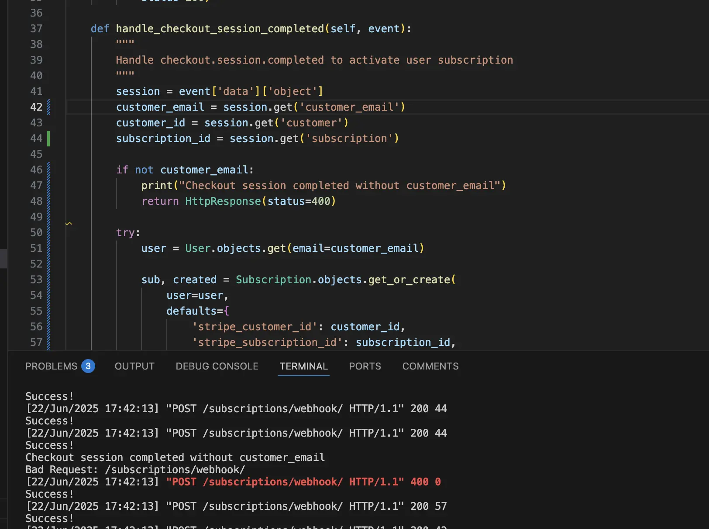
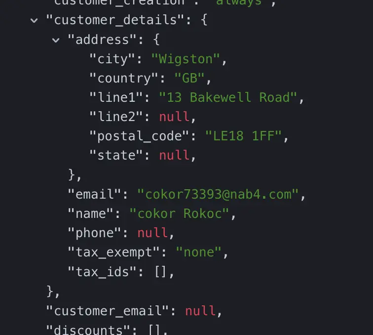

# PRINCESS PEACH TOADSTOOL

### Technologies Used:
HTML
CSS
JS
python
[kaboom](https://github.com/replit/kaboom)
django 
django allauth for user authentication
google sign in: https://docs.allauth.org/en/latest/socialaccount/providers/google.html 
canva.com to layout the homepage and choose a colour palette based on Princess Peach
coolors.com - image picker to extract the correct hex values for the palette used across the site.
[Tiled](https://www.mapeditor.org/)

PEACH PALETTE
/* CSS HEX */
--white: #FFFDFDff;
--jasmine: #FCD370ff;
--bleu-de-france: #2988F5ff;
--vista-blue: #9E9EDEff;
--black: #030304ff;
--salmon-pink: #F08293ff;
--razzmatazz: #E62F78ff;
 
### Bugs
Checkout session completed without email.

Issue: Stripe object returned an empty customer_email upon checkout despite entering an email during the checkout process. Subscription model would not then be generated nor associated with an authenticated user.
Fix: The stripe object had logged the email under customer_details{ email } so the variable customer_email needed to point at that instead:
    session.get('customer_email') or (
            session.get('customer_details', {}).get('email')
            )

### Reference
#### Base JS/Kaboom code and idea:  
- Ania Kubow: [2hrs to code Mario with Auth + save scores | JavaScript, CSS, HTML](https://youtu.be/1CVSI3MZNNg?si=TbMVZsDU_YM94oDa)
#### Additional useful resources:  
- FreeCodeCamp - GameDev with JavaScript and Kaboom.js: [Metroidvania Game Tutorial](https://youtu.be/iM1iSvloMlo?si=RQNq9j1hE3W3yzap) 
- JSLegendDev’s Substack: [How to use Tiled with Kaplay/Kaboom.js](https://jslegenddev.substack.com/p/how-to-use-tiled-with-kaboomjs)
- JSLegendDev: [How to build a platformer in Js with kaboom](https://www.youtube.com/watch?v=wZpbTR7pYR0)
- JSLegendDev's GitHub: [Mario-Game-Kaboom](https://github.com/JSLegendDev/Mario-Game-Kaboom.js/blob/master/main.js)
- Reddit post about using Django to design a game: [reddit.com](https://www.reddit.com/r/django/comments/181i3ix/can_you_design_a_game_with_django/)
- Box Shadow : [CSS-Tricks](https://css-tricks.com/almanac/properties/b/box-shadow/)
- Navbar styling: [W3S](https://www.w3schools.com/css/tryit.asp?filename=trycss_navbar_horizontal_black_active)
- Responsive font sizing: [W3S](https://www.w3schools.com/css/css_font_size.asp)
- Clamp() function: [W3S](https://www.w3schools.com/cssref/func_clamp.php)
- Clamp() calculator: [marcbacon.com](https://www.marcbacon.com/tools/clamp-calculator/)
Stripe documentation: 
 - https://docs.stripe.com/get-started/development-environment#api-keys
 - https://docs.stripe.com/checkout/embedded/quickstart
 - https://docs.stripe.com/billing/quickstart
 - https://dashboard.stripe.com/test/products/