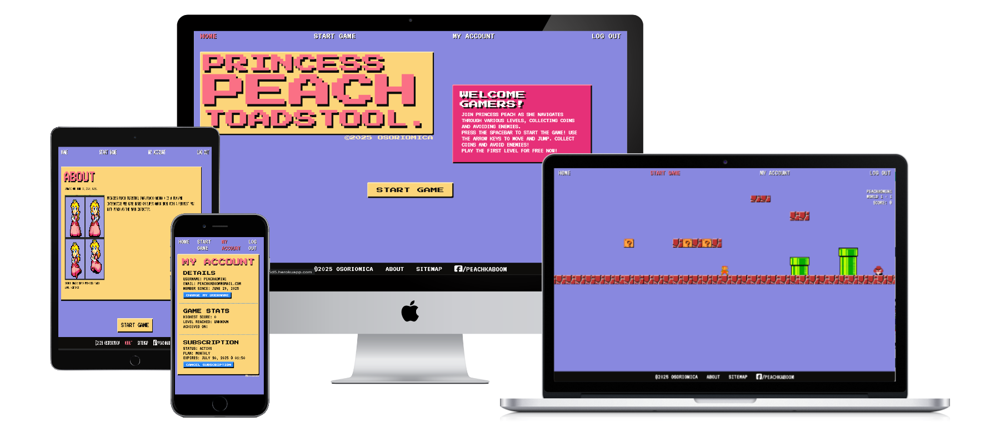
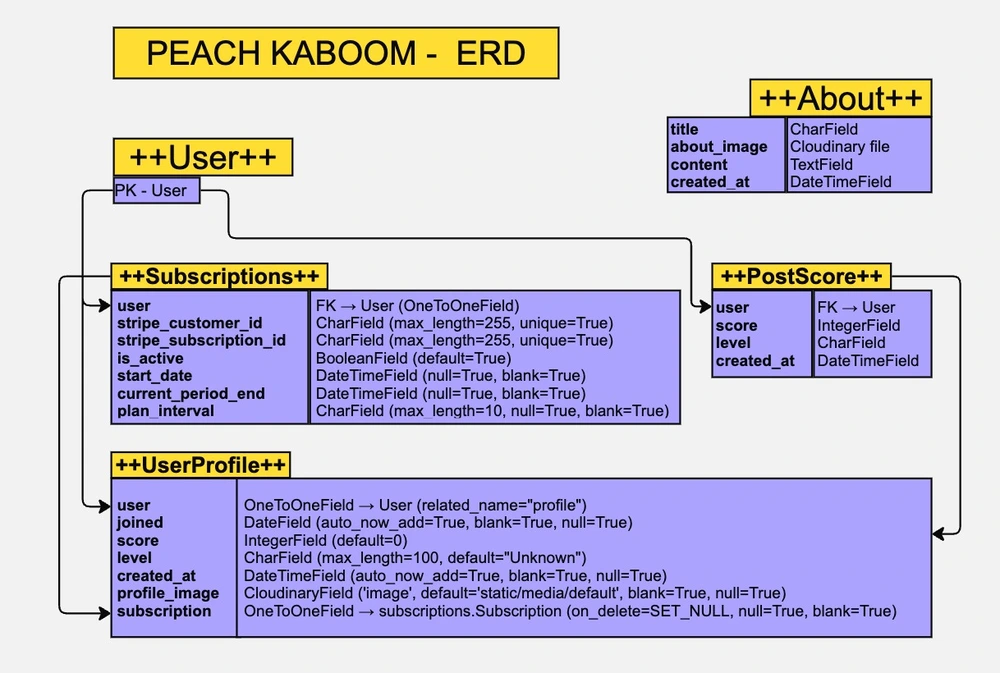
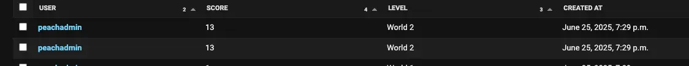
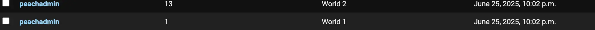

# PRINCESS PEACH TOADSTOOL (AKA PEACH KABOOM)



The deployed site can be found here: [Peach](https://peachkaboom-132026d215d5.herokuapp.com/)

<strong>Click here to view full screenshots of the website on the README folder.

[Full Screenshots](README-folder/full-screenshots)  </strong>


---

## Table of Contents

- [Introduction](#introduction)
- [UXD](#uxd)
  - [User Stories](#user-stories)
  - [Features](#features)
  - [Design](#design)
- [Database Schema](#database-schema)
- [Fixtures](#fixtures)
- [Views](#views)
- [Wireframes](#wireframes)
- [Technologies Used](#technologies-used)
- [Testing](#testing)
  - [Validation](#validation)
  - [Manual Testing](#manual-testing)
  - [Fixed Bugs](#fixed-bugs)
- [Deployment](#deployment)
- [Running the Project Locally](#running-the-project-locally)
- [Credits](#credits)
  - [Code](#code)
  - [Media](#media)
  - [Acknowledgements](#acknowledgements)

---

## Introduction

**Princess Peach Toadstool (AKA Peach Kaboom)** is a Django-powered Webgamne inspired by Super Mario Bros and powered by kaboom.js.
The site includes full backend functionality with admin controls, user authentication, payment handling and game interactions. 
The project was developed following the tutorial for "Boutique Ado" by Code Institute, as well as different tutorials on PLatformer games on Kaboom. See Credits for more information.

---

## UXD

### Development Timeline

| Week commencing: | Task 1                                                         | Task 2                                                    | Task 3                     | Task 4                                                                  |
| ---------------- | -------------------------------------------------------------- | --------------------------------------------------------- | -------------------------- | ----------------------------------------------------------------------- |
| April 28, 2025   | Draft strategy, scope, structure, skeleton and surface planes. | Make initial wireframes and mockups.                      | User Stories               | Explore imagery and color palette to be used in site.                   |
| May 5, 2025      | Initial commit.                                                | Set up Django project and recipes app. Create database    | Site deployment on Heroku. | Set up templates. Basic HTML layout, general CSS and Bootstrap styling. |
| May 12, 2025     | Add star rating feature                                        | Add authentication and comments section with Crispy forms | Debug code.                | Enable serving of image files with Cloudinary.                          |
| May 19, 2025     | Tidy up code and debug                                         | Add custom error pages  

### User Stories

PAYMENTS AND SUBSCRIPTIONS
As a user I can purchase a subscription so that I can access more game levelsI can review my payment details before subscribingI can cancel a paymentI can checkout securely through StripeI can view my subscriptions historyI can receive a confirmation email on the status of my subscription

ADMIN CRUD
As a site admin I have full CRUD access so that I can manage the site's users and subscriptionsI can create, read, update and delete users' accounts.I can send newsletters to users regarding the website.I can see a list of the current pro users.REGISTRATION AND USER 
ACCOUNTS
As a **user ** I can have a personal account so that I can access the game content.
User can register for a new accountSLogin and out with ease.Recover my password if forgotten.Receive email confirmation after registering.

VIEWING AND NAVIGATION
As a user I can quickly navigate the website so that I can play the gameI can start a new gameI can navigate through the website using the links provided

### Features

- **Homepage**:  
- **Profile**: Details, Game Stats and Subscription. User has crud over their username, subscription revewal.  
- **Authentication**: Django Allauth-powered login/signup/logout  
- **About**: About us page  
- **Game**: Free to play: World - 1, Subscription required for World - 2    
- **Subscription**: With a pricing table powered by Stripe. Webhooks to manage subscriptions.  
- **Responsive Design**: Mobile first. Optimized for all screen sizes  

### Design
The color scheme and fonts were chosen inspired by the opening scene of Super Mario Bros with the colour palette of Super Princess Peach.  All layouts are designed with a mobile-first approach.

- **Typography:**
  
  The project uses two main fonts to reinforce its retro arcade theme:
  
  - **Press Start 2P:** This pixel-style font is used for headings and titles, evoking the classic look of 8-bit and 16-bit video games. Its distinctive, blocky appearance immediately signals a nostalgic, playful atmosphere, making it ideal for a game inspired by classic platformers.
  - **VT323:** Used for general text elements, VT323 is a monospaced font that maintains readability while still referencing the era of vintage computer terminals and arcade machines. Its clean lines ensure that body text remains legible, even at smaller sizes, while still contributing to the overall retro aesthetic.
  
  Together, these fonts create a cohesive visual identity that supports both the game's theme and user experience.

- **Colour Palette:**

    | Color                                                                 | Hex         | Name           |
    |----------------------------------------------------------------------|-------------|----------------|
    |              | #8888df     | Vista Blue     |
    |              | #fcd57a     | Jasmine        |
    |              | #ffeab8     | Shadow Light   |
    |              | #fa7085     | Salmon Pink    |
    |              | #0e0d0b     | Shadow Dark    |
    |              | #FFFDFD     | White          |
    |              | #2988F5     | Bleu de France |
    |              | #E62F78     | Razzmatazz     |


- **Images:**
    Sprites used during development were provided by - Ania Kubow: [2hrs to code Mario with Auth + save scores | JavaScript, CSS, HTML](https://youtu.be/1CVSI3MZNNg?si=TbMVZsDU_YM94oDa)

---

## Database Schema
| Database Schema                            |                |                          |
| ------------------------------------------ | -------------- | ------------------------ |
| User Model                                 |                |                          |
| UserProfile Model                          |                |                          |
| FK                                         | user           | User Model               |
|                                            | joined         | DateTimeField            |
| FK                                         | score          | IntegerField             |
|                                            | level          | CharField                |
|                                            | created_at     | DateTimeField            |
| FK                                         | subscription   | OneToOneField            |
| About  Model                               |                |                          |
|                                            | title          | CharField                |
|                                            | about_image    | AWS file                 |
|                                            | content        | TextField                |
|                                            | created_at     | DateTimeField            |
|                                            | updated_at     | DateTimeField            |
| PostScore Model                            |                |                          |
| FK                                         | user           | User Model               |
| FK                                         | score          | IntegerField             |
|                                            | level          | CharField                |
|                                            | created_at     | DateTimeFied             |
| Subscriptions Model                        |                |                          |
| FK                                         | user           | OneToOneField            |
| Subscriptions Model                        |                |                          |
|                                            | stripe_customer_id      | CharField (max_length=255, unique=True)      |
|                                            | stripe_subscription_id  | CharField (max_length=255, unique=True)      |
|                                            | is_active              | BooleanField (default=True)                  |
|                                            | start_date             | DateTimeField (null=True, blank=True)        |
|                                            | current_period_end     | DateTimeField (null=True, blank=True)        |
|                                            | plan_interval          | CharField (max_length=10, null=True, blank=True) |
|                                            | created_at             | DateTimeField (auto_now_add=True)            |
|                                            | cancel_at_period_end   | BooleanField (default=False)                 |
---

## ERD

---

## Wireframes
Wireframes created with [miro.com](https://miro.com/).


---

## Technologies Used

- Languages: HTML5, CSS3, JS, Python
- [kaboom](https://github.com/replit/kaboom)
- [GitHub](https://github.com/) -  Used to host the project
- [Visual Studio Code](https://code.visualstudio.com/download) - IDE connected
- [canva.com](https://canva.com/) - Used to edit the sprites and mock up the UI
- [coolors.co](https://coolors.co/) - Used to create the colour palette based on Super Princess Peach
- [Django 5.2](https://docs.djangoproject.com/en/5.2/) - Used for responsive design and UI components.
- [Heroku](https://www.heroku.com/) - Used to deploy the project
- [AWS](https://aws.amazon.com/) - Used to host static files and media.
- [Django Allauth](https://docs.allauth.org/en/latest/) - Used for user authentication and account management.
- [Google Fonts](https://fonts.google.com/) - Used to customize the project's fonts. 
- [cloudconvert](https://cloudconvert.com/) - to convert images' formats.
- [PE8CI](https://pep8ci.herokuapp.com/#)
- [Mockup Generator](https://websitemockupgenerator.com/)
- [prettier.io](https://prettier.io) - to beautify the js and css code
- [Google's Inspect Element](https://developer.chrome.com/docs/devtools) - to debug code and see console logs and errors
- [Chat GPT](https://chatgpt.com/) - Used to explain concepts that were not so obvious and as a very useful aid in debugging.
- [tabletomarkdown.com](https://tabletomarkdown.com/convert-spreadsheet-to-markdown/): to easily generate my tables by importing spreadsheets.
- [Markdown TOC generator](https://bitdowntoc.derlin.ch/) - Used to automatically generate a table of contents 
- [Autoprefixer](https://autoprefixer.github.io/): to parse my CSS file and add the needed prefixes for browser compatibility.  
- [miro.com](https://miro.com/): to generate the ERD and wireframes
- [Tiled](https://www.mapeditor.org/)

---

## Testing

### Validation

[Validation Folder](README-folder/validation)
- HTML validated with [W3C Validator](https://validator.w3.org/) 
Index.html:  
      
Recipe_detail.html:  
      
- CSS validated with: [W3C Validator](https://validator.w3.org/) 
    
        <p>
            <a href="https://jigsaw.w3.org/css-validator/check/referer">
                
            </a>
        </p>

- JS validated with [JSHint](https://jshint.com/)  
  

- Python code checked with [PE8CI](https://pep8ci.herokuapp.com/#):
All python files were passed through the linter and cleaned until no errors were found. Here listed, are the ones with most code and which seemed relevant to share:

**Admin.py**  

 

**models.py**  

  

**urls.py**
  
  

**views.py**  

  

### Manual Testing

<strong>Manual testing</strong> involves checking a project’s functionality by simulating user interactions, typically through clicking buttons, filling out forms, and testing the logic and responsiveness in different browsers and resolutions. It is an essential way to ensure that a product meets the user's expectations but comes with limitations. It can be time-consuming, resource-intensive, and prone to human error,  making it unreliable (especially for larger projects). Tiredness, biases, and/or oversight can lead to missed bugs and issues that can dampen the user’s experience. Manual testing is best deployed when we need to assess the user experience (UX), or when testing specific user stories that require human judgment to evaluate nuances, which would not be picked by automated tests. 

<strong>Automated testing</strong>, on the other hand, uses code to run tests on software, providing a faster, scalable solution for detecting errors early in the development process. Automated tests can be written to target specific scenarios and run hundreds of tests in a short amount of time, making them ideal when verifying that new code hasn't broken existing functionality. However, automated tests are only as reliable as the test cases designed to check, and they do not assess the user experience. Therefore, a combination of manual and automated testing is often the best approach, where automated testing handles repetitive tasks and error detection; manual testing focuses on areas where human insight and user experience are critical. 

This site was thoroughly tested using a <strong>manual testing</strong> approach. These tests led to catching and fixing issues from early in the development. Some friends and family also contributed towards testing the game’s logic and provided valuable feedback. 

Please see below for the tests and final results:
| Test Label                | Test Action                                                                                                                                          | Expected Outcome                                                                                                                                                                                                                                                                                                                 | Test Outcome |
| ------------------------- | ---------------------------------------------------------------------------------------------------------------------------------------------------- | -------------------------------------------------------------------------------------------------------------------------------------------------------------------------------------------------------------------------------------------------------------------------------------------------------------------------------- | ------------ |
| Site’s responsiveness     | Resize site with Inspect Tool using different dimensions.                                                                                            | The site remains easy to read and uncluttered across different screen sizes. Images and text change depending on media queries.                                                                                                                                                                                                  | Pass         |
| Images                    | Static images are displayed properly. If no custom image is available, then a default placeholder is displayed.                                      | Image fields within about model allow the admin to upload an image, a placeholder is added by default if no image is specified. | Pass         |
| Header:                   |                                                                                                                                                      |                                                                                                                                                                                                                                                                                                                                  |              |
| Logo \| title             | Click on logo and title                                                                                                                              | Links to homepage                                                                                                                                                                                                                                                                                                                | Pass         |
| Styling                   | Resize the screen, hover/click on buttons                                                                                                            | Menu is responsive and the links are displayed clearly on the screen on different screen sizes                                                                                                                                                                                                                             | Pass         |
| Navigation links          | Click on links, check code                                                                                                                           | Opens requested page and updates the navbar links showing an active status                                                                                                                                                                                                                                                               | Pass         |
| Interactivity:            |                                                                                                                                                      |                                                                                                                                                                                                                                                                                                                                  |              |
| Buttons and links         | On hover, buttons and links change in style to show user they can be clicked on.                                                                     | On hover and when clicked, clickable elements change their styling to let user know they can interact with them.                                                                                                                                                                                                                 | Pass         |


### Fixed Bugs
#### Checkout session completed without email.


Issue: Stripe object returned an empty customer_email upon checkout despite entering an email during the checkout process. Subscription model would not then be generated nor associated with an authenticated user.
Fix: The stripe object had logged the email under customer_details{ email } so the variable customer_email needed to point at that instead:
    session.get('customer_email') or (
            session.get('customer_details', {}).get('email')
            )

#### Double score being posted to database.





Issue: Whilst transitioning from world 1 to world 2 and on completion of world 2 the total score would be saved twice for each level.
Fix: Add boolean flag around player-pipe interaction using [onCollideEnd](https://kaboomjs.com/#onCollideEnd).

#### Session's score not starting from 0 on play again
Issue: Upon completion of the game, if the user tried playing again, the score would carry on from the previous game instead of starting from 0. 
Fix: A helper async function that resets the score by using the method: request.session.pop(score, None) and then setting the redirect url values at the end of the game to window.location.href = '/game/world1/?new=true' - the query string refering to the conditional within the world1 view: if request.GET.get('new') == 'true': which then 'pops' the score and level from the session allowing the new game to start with a clean record. 

---

## Deployment
<strong>Create a GitHub Repository</strong>  
	1. Go to [GitHub website](https://github.com/) and navigate to the <strong>Settings</strong> tab.  
	2. [Create a new public repository](https://github.com/new) using the format username.github.io, where username is your GitHub username.    
	3. Optionally, add a repository description, select whether it will be public or private, and initialise it with a README file (optional).  
	4. <strong>Forking:</strong> If deploying a project you don’t own, fork the repository first by clicking the "Fork" button at the top right of the project repository.  
	5. Configure GitHub Pages later in the settings.  
2. <strong>Clone and Deploy a Project</strong>  
	1. (Optional) Install [GitHub Desktop](https://desktop.github.com/) if you prefer a graphical interface for managing repositories.  
	2. Clone the repository:  
		* After installing GitHub Desktop (if you're using it), refresh the page on GitHub and click the “Set up in Desktop” button.  
		* The GitHub Desktop app will open. Select a location to save the project and clone it.  
	3. Create an <strong>index.html</strong> file for your project if it doesn’t already exist.  
	4. Use the terminal to:  
		* <strong>Add</strong> your changes: git add .  
		* <strong>Commit</strong> your changes: git commit -m "Initial commit"  
		* <strong>Push</strong> your changes: git push origin main  
3. <strong>Clone and Deploy This Project</strong>  
	1. Go to my GitHub repository for this project: [Corazon de Patata](https://github.com/osoriomica/corazon_de_patata).  
	2. In the top right corner of the repository page, click the green Gitpod icon to open a new workspace in Gitpod.
	3. You can choose to work locally or download the project and edit it in an IDE like [Visual Studio Code](https://code.visualstudio.com/download).

### Deploy to [Heroku](https://www.heroku.com/) using the following steps:

1. Create `Procfile`, `requirements.txt`, `runtime.txt`
2. Set allowed hosts and static file settings in `settings.py`
3. Set up Cloudinary and environment variables
4. Push to GitHub → connect to Heroku via GitHub integration
5. Enable automatic deploys and run `heroku run python manage.py migrate`

---

## Running the Project Locally  

To run this project locally, follow the steps below:  

### 1. Clone the repository  
>```bash  
>git clone https://github.com/yourusername/corazon-de-patata.git  
>cd corazon-de-patata  
### 2. Create and activate a virtual environment  
>python3 -m venv venv  
>source venv/bin/activate  # On Windows: venv\Scripts\activate  
### 3. Install project dependencies  
>pip install -r requirements.txt  
### 4. Set environment variables  
Create a .env file in the root directory and include:  
>SECRET_KEY=your-django-secret-key  
>DEBUG=True  
>DATABASE_URL=sqlite:///db.sqlite3  
>CLOUDINARY_URL=your-cloudinary-url  
>ALLOWED_HOSTS=127.0.0.1,localhost  
### 5. Apply migrations and load fixtures  
>python manage.py migrate  
>python manage.py loaddata recipes.json  
### 6. Run the development server  
>python manage.py runserver    
Visit http://127.0.0.1:8000 in your browser.  

---

## Credits
### Reference
#### Base JS/Kaboom code and idea:  
- Ania Kubow: [2hrs to code Mario with Auth + save scores | JavaScript, CSS, HTML](https://youtu.be/1CVSI3MZNNg?si=TbMVZsDU_YM94oDa)
#### Additional useful resources:  
- FreeCodeCamp - GameDev with JavaScript and Kaboom.js: [Metroidvania Game Tutorial](https://youtu.be/iM1iSvloMlo?si=RQNq9j1hE3W3yzap) 
- JSLegendDev’s Substack: [How to use Tiled with Kaplay/Kaboom.js](https://jslegenddev.substack.com/p/how-to-use-tiled-with-kaboomjs)
- JSLegendDev: [How to build a platformer in Js with kaboom](https://www.youtube.com/watch?v=wZpbTR7pYR0)
- JSLegendDev's GitHub: [Mario-Game-Kaboom](https://github.com/JSLegendDev/Mario-Game-Kaboom.js/blob/master/main.js)
- Reddit post about using Django to design a game: [reddit.com](https://www.reddit.com/r/django/comments/181i3ix/can_you_design_a_game_with_django/)
- Box Shadow : [CSS-Tricks](https://css-tricks.com/almanac/properties/b/box-shadow/)
- Navbar styling: [W3S](https://www.w3schools.com/css/tryit.asp?filename=trycss_navbar_horizontal_black_active)
- Responsive font sizing: [W3S](https://www.w3schools.com/css/css_font_size.asp)
- Clamp() function: [W3S](https://www.w3schools.com/cssref/func_clamp.php)
- Clamp() calculator: [marcbacon.com](https://www.marcbacon.com/tools/clamp-calculator/)
- Window location reload with clear cache: [Stack Overflow](https://stackoverflow.com/questions/5721704/window-location-reload-with-clear-cache)
- async() :[MDN](https://developer.mozilla.org/en-US/docs/Web/JavaScript/Reference/Statements/async_function)
- Extension Modules: [MDN](https://developer.mozilla.org/en-US/docs/Learn_web_development/Extensions)
- Request and response objects: [Django docs](https://docs.djangoproject.com/en/5.2/ref/request-response/#django.http.HttpRequest.GET)
- Query Strings: [Wikipedia](https://en.wikipedia.org/wiki/Query_string)
Stripe documentation: 
 - https://docs.stripe.com/get-started/development-environment#api-keys
 - https://docs.stripe.com/checkout/embedded/quickstart
 - https://docs.stripe.com/billing/quickstart
 - https://dashboard.stripe.com/test/products/